# YouQuantiPy Architecture Documentation

**System**: Multi-Camera 3D Whole-Body Pose Estimation for Surgical Training
**Version**: 6.0
**Last Updated**: 2025-11-12
**Technology Stack**: Python, MMPose (RTMW3D), Tkinter, Shared Memory IPC, CUDA

---

## Table of Contents

1. [Executive Summary](#executive-summary)
2. [System Architecture Overview](#system-architecture-overview)
3. [Process Architecture](#process-architecture)
4. [Buffer Architecture](#buffer-architecture)
5. [Data Flow Sequences](#data-flow-sequences)
6. [Key Architectural Patterns](#key-architectural-patterns)
7. [Configuration Management](#configuration-management)
8. [Metrics Calculation Pipeline](#metrics-calculation-pipeline)
9. [Process Lifecycle](#process-lifecycle)
10. [Memory Footprint Analysis](#memory-footprint-analysis)
11. [Critical Files Reference](#critical-files-reference)
12. [System Diagrams](#system-diagrams)
13. [Troubleshooting Guide](#troubleshooting-guide)

---

## Executive Summary

YouQuantiPy is a **real-time multi-camera 3D whole-body pose estimation system** designed for surgical training applications. Built on MMPose (RTMW3D), the system achieves **30+ FPS** performance through sophisticated inter-process communication using shared memory buffers, ring buffer architectures, and lock-free synchronization patterns.

### Key Features

- **Multi-camera support**: Up to 10 cameras simultaneously
- **133 keypoints per person**: Whole-body tracking (body, face, hands, feet)
- **Distance-invariant metrics**: Ergonomic analysis (head tilt, shoulder elevation)
- **Zero-copy data transfer**: Shared memory for high-performance IPC
- **Lock-free synchronization**: Ring buffers with atomic operations
- **CUDA-optimized**: GPU-accelerated pose estimation with isolated contexts

### Technology Highlights

- **Process Model**: Spawn-based multiprocessing for CUDA isolation
- **IPC Mechanism**: Shared memory (`/dev/shm`) with semaphore coordination
- **Buffer Strategy**: Ring buffers (4-32 slots) for collision-resistant data flow
- **GUI Framework**: Tkinter with custom Azure theme
- **Visualization**: Matplotlib 3D skeleton rendering

---

## System Architecture Overview

### High-Level Component Hierarchy

```
YouQuantiPy System
├── Main Process (gui.py)
│   ├── Tkinter GUI (MainApplication)
│   ├── BufferCoordinator (centralized buffer management)
│   ├── CameraWorkerManager (spawns camera workers)
│   └── GUIProcessingWorker (dedicated display processing)
│
├── Camera Worker Processes (1 per camera, up to 10)
│   ├── Camera Source (V4L2 or ZMQ network streaming)
│   ├── RTMPose3D Process (person detection + 3D pose)
│   └── Frame Buffer Writer (lock-free ring buffer)
│
├── GUI Processing Worker Process
│   ├── Frame Reader (reads from camera buffers)
│   ├── Pose Reader (reads from pose buffers)
│   ├── Metrics Calculator (ergonomic analysis)
│   └── Display Buffer Writer (pre-rendered GUI data)
│
└── Optional Subsystems
    ├── LSL Streaming (Lab Streaming Layer)
    ├── Video Recording (per-participant)
    ├── Audio Recording
    └── Bluetooth Integration (Polar H10 HR monitors)
```

---

## Process Architecture

### Process Topology Diagram


### Process Communication Matrix

| Process Pair | Communication Method | Data Type | Synchronization |
|--------------|---------------------|-----------|-----------------|
| Main → Camera Workers | Control Queues, Semaphores | Commands, Configuration | Events |
| Camera Workers → Main | Status Queues | Health, FPS, Errors | Polling |
| Camera → RTMPose3D | Frame Buffer (SHM) | Raw frames | Semaphore |
| RTMPose3D → GUI Worker | Pose Buffer (SHM) | 3D keypoints | Ring index |
| GUI Worker → Main | Display Buffer (SHM) | Pre-rendered data | Ring index |
| Camera → GUI Worker | Frame Buffer (SHM) | Raw frames | Ring index |

### Why Spawn Mode?

**Critical Decision**: The system uses `multiprocessing` with `spawn` mode (not `fork`):

**Benefits**:
- **CUDA context isolation**: Each process gets independent GPU memory
- **Clean state**: No inherited file descriptors or locks
- **TensorRT compatibility**: Avoids engine serialization issues

**Challenges**:
- **No pickle for semaphores**: Must pass via BufferCoordinator
- **Module imports**: Target functions must be importable at module level
- **Memory duplication**: Config dicts copied to each process

---

## Buffer Architecture

### Centralized Buffer Configuration

**Single Source of Truth**: `youquantipy_config.json` → `buffer_settings`

All buffer-related configuration parameters are centralized into a single structure. This provides consistency and prevents scattered configuration across different sections.

```json
{
  "buffer_settings": {
    "persons": {
      "max_persons": 1,
      "participant_count": 1
    },
    "cameras": {
      "max_cameras": 10,
      "camera_count": 1
    },
    "faces": {
      "max_faces_per_frame": 1
    },
    "ring_buffers": {
      "frame_detection": 32,
      "pose_estimation": 4,
      "roi_processing": 8,
      "gui_display": 8,
      "display_manager": 4
    },
    "pinned_memory": {
      "detection_frames": 4,
      "roi_buffers": 16,
      "hd_frames": 2
    }
  }
}
```

### Buffer Types and Memory Layouts

#### Frame Buffer (Per Camera)

**Purpose**: Store captured camera frames in a ring buffer for multi-reader access.

**Layout**:
```
┌─────────────────────────────────────────────────────────────┐
│ Header (16 bytes)                                           │
│  ├─ write_index (8 bytes) ← Atomic update point            │
│  ├─ width (4 bytes)                                         │
│  └─ height (4 bytes)                                        │
├─────────────────────────────────────────────────────────────┤
│ Ring Buffer Slots (32 slots for frame_detection)           │
│  ├─ Slot 0: Frame Data (width × height × 3 BGR)           │
│  ├─ Slot 1: Frame Data                                     │
│  ├─ ...                                                     │
│  └─ Slot 31: Frame Data                                    │
├─────────────────────────────────────────────────────────────┤
│ Metadata Slots (32 × 64 bytes)                             │
│  ├─ Slot 0: frame_id, timestamp, is_detection, ready       │
│  ├─ Slot 1: metadata                                        │
│  ├─ ...                                                     │
│  └─ Slot 31: metadata                                       │
└─────────────────────────────────────────────────────────────┘

Size Calculation:
  Header: 16 bytes
  Frames: 32 × 1280 × 720 × 3 = 88,473,600 bytes (~84 MB)
  Metadata: 32 × 64 = 2,048 bytes
  Total: ~84.5 MB per camera
```

**Shared Memory Name**: `yq_frame_{camera_index}_{buffer_type}`

**File**: `core/buffer_management/layouts.py:FrameBufferLayout`

#### Pose Buffer (Per Camera)

**Purpose**: Store 3D pose estimation results (RTMW3D: 133 keypoints per person).

**Layout**:
```
┌─────────────────────────────────────────────────────────────┐
│ Write Index (8 bytes) ← Atomic update point                │
├─────────────────────────────────────────────────────────────┤
│ Ring Buffer: Pose Data Slots (4 slots)                     │
│  ├─ Slot 0: Pose Data (max_persons × 133 × 4 × float32)   │
│  │    RTMW3D Keypoint Breakdown:                           │
│  │    - 17 body keypoints                                  │
│  │    - 6 foot keypoints                                   │
│  │    - 68 face keypoints                                  │
│  │    - 42 hand keypoints (21 per hand)                    │
│  │    Each keypoint: (x, y, z, confidence)                 │
│  ├─ Slot 1: Pose Data (2,128 bytes for 1 person)          │
│  ├─ Slot 2: Pose Data                                      │
│  └─ Slot 3: Pose Data                                      │
├─────────────────────────────────────────────────────────────┤
│ Ring Buffer: Metadata Slots (4 × 128 bytes)                │
│  ├─ Slot 0: frame_id, timestamp, n_persons, ready          │
│  ├─ Slot 1: metadata                                        │
│  ├─ Slot 2: metadata                                        │
│  └─ Slot 3: metadata                                        │
└─────────────────────────────────────────────────────────────┘

Size Calculation (max_persons=1):
  Header: 8 bytes
  Pose ring: 4 × 1 × 133 × 4 × 4 = 8,512 bytes
  Metadata ring: 4 × 128 = 512 bytes
  Total: 9,032 bytes (~9 KB)
```

**Shared Memory Name**: `yq_pose_{camera_index}`

**File**: `core/buffer_management/layouts.py:Pose3DBufferLayout`

#### Display Buffer (Per Camera)

**Purpose**: Pre-rendered display data optimized for GUI consumption (metadata only, not full frames).

**Layout**:
```
┌─────────────────────────────────────────────────────────────┐
│ Write Index (8 bytes) ← Monotonic counter                  │
├─────────────────────────────────────────────────────────────┤
│ Ring Buffer: Display Slots (4 slots)                       │
│  ├─ Slot 0:                                                 │
│  │    ├─ Frame Metadata (64 bytes)                         │
│  │    │    frame_id, timestamp, n_faces                    │
│  │    └─ Face Data Array (max_faces × 3,856 bytes)         │
│  │         For each face:                                   │
│  │         - face_id, participant_id, track_id (12 bytes)  │
│  │         - bbox (x1,y1,x2,y2), confidence (20 bytes)     │
│  │         - label string (64 bytes)                        │
│  │         - display_flags (enrollment state) (4 bytes)     │
│  │         - landmarks (478 × 3 × float32 = 5,736 bytes)   │
│  ├─ Slot 1: Display Data                                    │
│  ├─ Slot 2: Display Data                                    │
│  └─ Slot 3: Display Data                                    │
└─────────────────────────────────────────────────────────────┘

Size: ~15 KB per camera (frame data NOT stored, just references)
```

**Key Design**: Display buffer stores **references** to frame_ids, not duplicate frame data. GUI reads actual frames from the Frame Buffer.

**File**: `core/buffer_management/layouts.py:DisplayBufferLayout`

### BufferCoordinator - Central Authority

**File**: `core/buffer_management/coordinator.py` (2,159 lines)

The BufferCoordinator is the **single source of truth** for all buffer management operations.

**Responsibilities**:
- **Unified buffer creation** for all cameras
- **Layout calculations** from centralized config
- **Semaphore management** (frame_ready, pose_ready)
- **Resolution tracking** (dynamic buffer sizing)
- **Cleanup orchestration** (prevents stale buffers)

**Key Methods**:

```python
def get_layout(buffer_type: str, camera_index: int) -> BufferLayout:
    """Type-safe layout retrieval with validation"""

def create_camera_buffers(camera_index: int, resolution: Tuple[int, int]):
    """Create complete buffer set for one camera"""

def get_frame_ready_semaphore(camera_index: int) -> Semaphore:
    """Event-driven synchronization for frame availability"""

def cleanup_all_buffers():
    """Graceful shutdown and memory cleanup"""
```

**Design Pattern**: Singleton-like coordinator prevents buffer fragmentation and ensures consistency.

---

## Data Flow Sequences

### Camera Frame Capture to Pose Estimation


**Critical Pattern**: Writer increments index **AFTER** writing data (atomic commit pattern).

### Pose Data to GUI Rendering


**Race Condition Prevention**: Double-read consistency check ensures no partial data.

### Complete Pipeline Flow

```
┌─────────────┐
│ Camera      │ 30 FPS capture
│ Source      │
└──────┬──────┘
       │
       ▼
┌─────────────┐
│ Frame       │ Lock-free write
│ Buffer      │ Ring: 32 slots
│ (SHM)       │
└──────┬──────┘
       │
       ▼
┌─────────────┐
│ RTMPose3D   │ GPU inference
│ Process     │ RTMDet + RTMW3D
└──────┬──────┘
       │
       ▼
┌─────────────┐
│ Pose        │ Atomic write
│ Buffer      │ Ring: 4 slots
│ (SHM)       │
└──────┬──────┘
       │
       ▼
┌─────────────┐
│ GUI         │ Metrics calc
│ Worker      │ Transform 3D→2D
└──────┬──────┘
       │
       ▼
┌─────────────┐
│ Display     │ Pre-rendered
│ Buffer      │ Ring: 4 slots
│ (SHM)       │
└──────┬──────┘
       │
       ▼
┌─────────────┐
│ Main GUI    │ 60 Hz rendering
│ Thread      │ Tkinter canvas
└─────────────┘
```

---

## Key Architectural Patterns

### 1. Producer-Consumer Pipeline

**Pattern**: Multi-stage processing with intermediate buffers.

```
Camera Source → Frame Buffer → Pose Estimator → Pose Buffer → GUI Worker → Display Buffer → GUI Renderer
(Producer)      (Shared Mem)   (Consumer +      (Shared Mem)  (Consumer +   (Shared Mem)   (Consumer)
                               Producer)                       Producer)
```

**Benefits**:
- Decouples processing stages (independent failure isolation)
- Enables parallel execution (CPU and GPU concurrency)
- Natural backpressure handling (ring buffer overflow → drop frames)

### 2. Ring Buffer Pattern (Lock-Free Synchronization)

**Core Concept**: Circular buffer with monotonic write index.

```
Writer Process:                    Reader Process:
┌─────────────────┐               ┌─────────────────┐
│ Write data to   │               │ Read write_idx  │
│ slot[N % size]  │               │ (before)        │
├─────────────────┤               ├─────────────────┤
│ Write metadata  │               │ Read data from  │
│ to slot[N]      │               │ slot[(N-1)%size]│
├─────────────────┤               ├─────────────────┤
│ Increment N     │──────────────►│ Read write_idx  │
│ (atomic)        │               │ (after)         │
└─────────────────┘               ├─────────────────┤
                                  │ If changed:     │
                                  │   Discard, retry│
                                  └─────────────────┘
```

**Properties**:
- **Lock-free**: No mutexes, only atomic integer operations
- **Collision-resistant**: Multiple slots reduce writer/reader conflicts
- **Predictable latency**: O(1) access, fixed memory layout
- **Power-of-2 optimization**: Fast modulo via bitwise AND

**Critical Implementation Detail**:

```python
# WRONG - Race condition window
write_idx += 1
buffer.write_index = write_idx  # ← Reader sees "ready" signal
buffer.write_data(data)         # ← But data not written yet!

# CORRECT - Atomic write pattern
buffer.write_data(data)         # ← Write data FIRST
buffer.write_metadata(metadata)
write_idx += 1
buffer.write_index = write_idx  # ← Signal ready LAST (atomic commit)
```

**Files**:
- Writer: `core/pose_processing/rtmpose3d_process.py:820-865`
- Reader: `core/gui_interface/gui_processing_worker.py:1450-1520`

### 3. Event-Driven Synchronization

**Pattern**: Semaphores instead of busy-wait polling.

```python
# Producer (Camera Worker)
capture_frame()
write_to_frame_buffer()
pose_frame_ready_semaphore.release()  # Signal: "data ready"

# Consumer (RTMPose3D Process)
pose_frame_ready_semaphore.acquire()  # Block until signal
frame = read_from_frame_buffer()
process_frame()
```

**Benefits**:
- **CPU efficiency**: No spinning, process sleeps until wakeup
- **Low latency**: Immediate wakeup on data availability
- **Scalable**: Handles multiple cameras without polling overhead

### 4. Zero-Copy Data Transfer

**Pattern**: Shared memory with NumPy buffer protocol.

```python
# Writer Process
shm = shared_memory.SharedMemory(name='yq_frame_0', create=True, size=buffer_size)
frame_view = np.ndarray(shape=(H, W, 3), dtype=np.uint8, buffer=shm.buf[offset:])
frame_view[:] = captured_frame  # Direct memory write (no serialization)

# Reader Process
shm = shared_memory.SharedMemory(name='yq_frame_0')  # Open existing
frame_view = np.ndarray(shape=(H, W, 3), dtype=np.uint8, buffer=shm.buf[offset:])
display_frame = frame_view.copy()  # Read directly from shared memory
```

**Benefits**:
- **No serialization overhead**: No pickle/JSON encoding
- **No IPC overhead**: No pipes, sockets, or queues for data
- **Memory efficient**: Single copy shared across processes
- **High bandwidth**: Limited only by memory bus speed

**Tradeoff**: Requires careful synchronization (hence ring buffers).

### 5. Spawn Mode Process Isolation

**Decision**: Use `multiprocessing.set_start_method('spawn')` instead of `fork`.

**Rationale**:
- **CUDA context safety**: Each process gets independent GPU context
- **TensorRT compatibility**: Avoids engine serialization issues
- **Clean state**: No inherited file descriptors, locks, or threads

**Implementation Requirement**:
```python
# Target function MUST be importable at module level
def camera_worker_process(camera_index, config_dict, semaphore_names):
    # Cannot pass semaphore objects directly (not picklable in spawn mode)
    # Must reconstruct from names via BufferCoordinator
    pass

if __name__ == '__main__':
    multiprocessing.set_start_method('spawn')
    process = multiprocessing.Process(target=camera_worker_process, args=(...))
    process.start()
```

---

## Configuration Management

### Configuration Flow Diagram


### ConfigHandler Pattern

**File**: Distributed across multiple modules, loaded via `json.load()`

**Access Pattern**:
```python
# Dot notation access (nested keys)
config = load_config()
max_persons = config.get('buffer_settings', {}).get('persons', {}).get('max_persons', 1)

# Centralized buffer settings
ring_size = config['buffer_settings']['ring_buffers']['pose_estimation']
```

**Validation**:
- Type checking via dataclasses (`MetricsConfig`, `PoseMetrics`)
- Default values prevent crashes on missing keys
- Flattening for nested structures (e.g., `shoulder_elevation` section)

---

## Metrics Calculation Pipeline

### Ergonomic Pose Metrics System

**File**: `core/metrics/pose_metrics_calculator.py` (~900 lines)

The system calculates **distance-invariant, body-proportional metrics** for ergonomic analysis.

### 1. Head Tilt Calculation (v3.0)

**Metric**: Head orientation relative to neck (looking up/down).

**Algorithm**:
```python
# Extract keypoints
nose = keypoints[0]           # Index [0] = nose
left_ear = keypoints[3]       # Index [3] = left ear
right_ear = keypoints[4]      # Index [4] = right ear
left_shoulder = keypoints[5]
right_shoulder = keypoints[6]

# Calculate midpoints
ear_midpoint = (left_ear + right_ear) / 2
shoulder_midpoint = (left_shoulder + right_shoulder) / 2

# Anatomical correction (ears are above nose)
inter_ear_distance = ||right_ear - left_ear||
vertical_offset = inter_ear_distance * ear_to_nose_drop_ratio  # Default: 0.20
ear_midpoint_corrected = ear_midpoint.copy()
ear_midpoint_corrected[2] -= vertical_offset  # CRITICAL: Index [2] = Z-axis (vertical)

# Calculate vectors
neck_vector = ear_midpoint - shoulder_midpoint  # Upward direction of neck
face_vector = nose - ear_midpoint_corrected     # Forward direction of face

# Angle between vectors
cos_angle = dot(neck_vector, face_vector) / (||neck_vector|| × ||face_vector||)
vector_angle = arccos(cos_angle) × 180 / π

# Convert to head tilt (0° = neutral, perpendicular)
head_tilt = 90° - vector_angle
```

**Interpretation**:
- **0°** = Neutral (face perpendicular to neck)
- **Negative** = Looking down
- **Positive** = Looking up

**Critical Fix (2025-11-08)**: Changed correction from index `[1]` (depth) to `[2]` (vertical) to match visualization coordinate system. Reduced error from 50° to <1°.

**File**: `core/visualization/skeleton_3d_renderer.py:109, 300`

### 2. Shoulder Elevation Calculation (v6.0)

**Metric**: Multi-component shoulder shrugging detection (distance-invariant).

**Three Components**:

#### Component 1: Ear-to-Shoulder Ratio
```python
ear_shoulder_distance = ||ear_midpoint - shoulder||
shoulder_width = ||right_shoulder - left_shoulder||
ear_shoulder_ratio = ear_shoulder_distance / shoulder_width
```
- **Measures**: Shoulders moving toward head
- **Direction**: Lower = elevated (shrugging)
- **Typical range**: 1.0 - 2.5

#### Component 2: Torso Height Ratio
```python
hip_midpoint = (left_hip + right_hip) / 2
torso_height = ||shoulder - hip_midpoint||
torso_height_ratio = torso_height / shoulder_width
```
- **Measures**: Shoulders moving away from hips (absolute elevation)
- **Direction**: Higher = elevated
- **Typical range**: 1.3 - 1.8

#### Component 3: Composite Elevation Score
```python
# Deviations from neutral baselines
ear_deviation = neutral_ear_ratio - current_ear_ratio       # Positive when elevated
torso_deviation = current_torso_ratio - neutral_torso_ratio  # Positive when elevated

# Weighted combination
composite_score = (ear_weight × ear_deviation) + (torso_weight × torso_deviation)
```
- **Measures**: Combined shoulder elevation signal
- **Direction**: Positive = elevated, 0 = neutral, negative = relaxed
- **Typical range**: -0.5 to +0.5

**Configuration** (`youquantipy_config.json`):
```json
{
  "metrics_settings": {
    "shoulder_elevation": {
      "neutral_ear_shoulder_ratio": 1.5,
      "neutral_torso_height_ratio": 1.6,
      "ear_component_weight": 0.5,
      "torso_component_weight": 0.5
    }
  }
}
```

**Benefits**:
- **Distance-invariant**: Normalized by shoulder width (same posture = same ratio at any camera distance)
- **Multi-dimensional**: Captures both head-relative and pelvis-relative shoulder position
- **Robust**: Composite score less sensitive to head position changes
- **Clinically relevant**: Individual components reveal different aspects of posture

**File**: `core/metrics/pose_metrics_calculator.py:497-609`

### Metrics Data Flow

```
RTMPose3D Output (133 keypoints × 4 values)
    │
    ├─► PoseMetricsCalculator
    │   │
    │   ├─► _calculate_head_tilt()
    │   │   ├─ Extract: nose, ears, shoulders
    │   │   ├─ Apply anatomical correction (vertical offset)
    │   │   ├─ Calculate neck & face vectors
    │   │   └─ Return: (vector_angle, head_tilt)
    │   │
    │   └─► _calculate_shoulder_shrug()
    │       ├─ Extract: ears, shoulders, hips
    │       ├─ Calculate ear-shoulder ratio (left/right)
    │       ├─ Calculate torso height ratio (left/right)
    │       ├─ Calculate composite score (left/right)
    │       └─ Return: 6 values (left/right × 3 components)
    │
    └─► PoseMetrics (dataclass)
        ├─ head_tilt_angle: float
        ├─ shoulder_elevation_left/right: float
        ├─ torso_height_left/right: float
        └─ shoulder_composite_left/right: float
```

**Output Format** (GUI display):
```
Head Tilt: +5.2°
Shoulder Elevation:
  Left:  E:1.48  T:1.62  C:+0.12
  Right: E:1.52  T:1.59  C:+0.08
```

**Legend**:
- **E**: Ear-shoulder ratio (lower = elevated)
- **T**: Torso height ratio (higher = elevated)
- **C**: Composite score (positive = elevated, 0 = neutral)

---

## Process Lifecycle

### System Startup Sequence


### Graceful Shutdown Sequence


**Critical Cleanup Steps**:
1. **Stop producers first** (camera workers) to prevent new data
2. **Terminate subprocesses** (RTMPose3D) to release GPU memory
3. **Close SHM handles** before unlinking (prevents orphaned memory)
4. **Clean /dev/shm** to prevent stale buffer accumulation

**File**: `core/buffer_management/coordinator.py:cleanup_all_buffers()`

---

## Memory Footprint Analysis

### Per-Camera Buffer Allocation

**Configuration**: 1 person, 1280×720 resolution

| Buffer Type | Ring Slots | Slot Size | Total Size |
|-------------|------------|-----------|------------|
| Frame Buffer | 32 | 1280×720×3 = 2.76 MB | **88.5 MB** |
| Pose Buffer | 4 | 1×133×4×4 = 2.1 KB | **9 KB** |
| Display Buffer | 4 | 64 + 1×3856 = 3.9 KB | **15 KB** |
| **Per-Camera Total** | - | - | **~84.5 MB** |

### Multi-Camera Scaling

| Cameras | Frame Buffers | Pose Buffers | Display Buffers | **Total SHM** |
|---------|---------------|--------------|-----------------|---------------|
| 1 | 84.5 MB | 9 KB | 15 KB | **~84.5 MB** |
| 4 | 338 MB | 36 KB | 60 KB | **~338 MB** |
| 10 (max) | 845 MB | 90 KB | 150 KB | **~845 MB** |

### GPU Memory (Per Process)

| Component | Memory Usage |
|-----------|--------------|
| RTMW3D Model (TensorRT) | ~800 MB |
| CUDA Context | ~200 MB |
| Pinned Memory Buffers | ~50 MB |
| **Per RTMPose3D Process** | **~1 GB** |

**10 Camera System**: ~10 GB GPU memory + 845 MB shared memory

### Optimization Opportunities

**Completed (v2.0)**:
- ✅ Reduced `max_persons` from 4 to 1: **75% pose buffer reduction**
- ✅ Centralized buffer configuration: Prevented over-allocation

**Future Optimizations**:
- 🔄 Dynamic ring buffer sizing based on FPS (lower FPS = fewer slots)
- 🔄 Shared Frame Buffer across readers (currently duplicated for GUI Worker)
- 🔄 Compressed pose buffer (quantize float32 → int16 for storage)

---

## Critical Files Reference

### Core Architecture Files

| File | Lines | Purpose |
|------|-------|---------|
| **gui.py** | 9,544 | Main application orchestrator, Tkinter GUI, camera/buffer management |
| **core/buffer_management/coordinator.py** | 2,159 | Buffer authority, layout calculations, semaphore provider |
| **core/buffer_management/layouts.py** | 542 | Type-safe buffer layout dataclasses |
| **core/buffer_management/camera_worker_enhanced.py** | ~2,000 | Camera capture, frame buffer writer, subprocess coordination |
| **core/pose_processing/rtmpose3d_process.py** | ~1,200 | MMPose 3D pose estimation subprocess, pose buffer writer |
| **core/gui_interface/gui_processing_worker.py** | ~2,500 | Dedicated GUI processing worker, metrics calculator |

### Visualization & Rendering

| File | Lines | Purpose |
|------|-------|---------|
| **core/visualization/skeleton_3d_renderer.py** | ~800 | Matplotlib 3D skeleton plotting, head tilt visualization |
| **core/visualization/rtmpose_visualizer.py** | ~600 | 2D pose overlay rendering (keypoints, bones, labels) |
| **core/gui_interface/canvasdrawing.py** | ~1,200 | Tkinter canvas drawing manager, bounding box rendering |

### Metrics & Processing

| File | Lines | Purpose |
|------|-------|---------|
| **core/metrics/pose_metrics_calculator.py** | ~900 | Ergonomic metrics (head tilt, shoulder elevation) |
| **core/metrics/metrics_dataclasses.py** | ~250 | Data structures for metrics (`PoseMetrics`, `MetricsConfig`) |
| **core/pose_processing/pose_smoother.py** | ~400 | Exponential Moving Average (EMA) temporal smoothing |

### Camera & Streaming

| File | Lines | Purpose |
|------|-------|---------|
| **core/camera_sources/v4l2_camera.py** | ~600 | Linux V4L2 camera capture (native /dev/video*) |
| **core/camera_sources/zmq_camera.py** | ~500 | ZMQ network camera streaming (Windows bridge) |
| **core/camera_sources/factory.py** | ~200 | Camera source factory pattern |

### Configuration & Utilities

| File | Lines | Purpose |
|------|-------|---------|
| **youquantipy_config.json** | ~800 | Centralized system configuration (JSON) |
| **core/utils/coordinate_transform.py** | ~300 | 3D-to-2D coordinate projection, camera intrinsics |
| **core/utils/config_handler.py** | ~400 | Configuration loading, validation, auto-save |

---

## System Diagrams

### Complete System Wiring Diagram

See [Process Architecture](#process-architecture) section above for the main wiring diagram.

### Buffer Memory Layout

```mermaid
graph LR
    subgraph FB["Frame Buffer Layout"]
        direction TB
        FH[Header 16B<br/>write_idx, width, height]
        FR[Ring Buffer<br/>32 slots × frame_size]
        FM[Metadata<br/>32 slots × 64B]
        FH --> FR --> FM
    end

    subgraph PB["Pose Buffer Layout"]
        direction TB
        PH[write_idx 8B]
        PR[Pose Ring<br/>4 slots × 2,128B<br/>133 keypoints]
        PM[Metadata<br/>4 slots × 128B]
        PH --> PR --> PM
    end

    subgraph DB["Display Buffer Layout"]
        direction TB
        DH[write_idx 8B]
        DR[Display Ring<br/>4 slots × slot_size<br/>Face metadata]
        DH --> DR
    end
```



### Configuration Hierarchy


---

## Troubleshooting Guide

### Common Issues and Solutions

#### 1. Buffer Size Mismatch Errors

**Symptoms**:
- `ValueError: cannot reshape array of size X into shape Y`
- Shared memory access violations
- Corrupted pose data

**Root Cause**: Stale shared memory buffers from previous runs with different configurations.

**Solution**:
```bash
# Clean all YouQuantiPy shared memory buffers
rm -f /dev/shm/yq_*

# Kill all Python processes
pkill -9 python3

# Restart application
./run.sh
```

**Prevention**: BufferCoordinator automatically cleans stale buffers on startup (v2.0+).

#### 2. Frame Offset Artifacts (Movement/Color Corruption)

**Symptoms**:
- Camera feed shows unexpected movement when person is still
- Color corruption or vertical/horizontal bands
- Frame appears to "slide" or have offset regions

**Root Cause**: Frame shape mismatch between expected resolution (buffer allocation) and actual incoming frame.

**Solution**: Frame validation implemented in v4.0 (2025-11-11).

**Verification**:
```bash
# Enable debug logging to see frame validation
./venv/bin/python3 gui.py 2>&1 | grep -E "(shape|contiguous|READER VALIDATION)"

# Expected output every 100 frames:
# DEBUG Camera 0 Frame 100: shape=(1080, 1920, 3), strides=(5760, 3, 1), contiguous=True
```

**Files**:
- Writer validation: `core/buffer_management/camera_worker_enhanced.py:1496-1523`
- Reader validation: `core/gui_interface/gui_processing_worker.py:1782-1812`

#### 3. Pose "Blow-Up" Frames (Wrong Keypoints)

**Symptoms**:
- Pose visualization shows completely wrong keypoints for 1-2 frames
- Skeleton "jumps" to random positions intermittently
- Returns to normal after brief artifact

**Root Cause**: Race condition in shared memory writer (reader sees partial data).

**Solution**: Atomic write pattern implemented in v1.0 (2025-11-08).

**Verification**:
```python
# Check writer increments index LAST (after data written)
# File: core/pose_processing/rtmpose3d_process.py:_write_pose_results()

# CORRECT pattern:
# 1. Write pose data
# 2. Write metadata
# 3. Increment write_idx (atomic commit)
```

**Files**:
- Writer fix: `core/pose_processing/rtmpose3d_process.py:820-865`
- Reader fix: `core/gui_interface/gui_processing_worker.py:1450-1520`

#### 4. Head Tilt Showing Wrong Angles

**Symptoms**:
- Head tilt shows -60° when orange/red lines appear perpendicular (90°)
- Angles don't match visual appearance
- Consistent 40-50° offset

**Root Cause**: Vertical correction applied to wrong axis (index [1] instead of [2]).

**Solution**: Coordinate system fix in v3.0 (2025-11-08).

**Verification**:
```python
# Check anatomical correction uses index [2] (vertical in visualization)
# File: core/metrics/pose_metrics_calculator.py:284

ear_midpoint_corrected[2] -= vertical_offset  # ✓ Correct (Z-axis = vertical)
# NOT [1] (Y-axis = depth)
```

**Files**:
- `core/visualization/skeleton_3d_renderer.py:109, 300`
- `core/metrics/pose_metrics_calculator.py:284`

#### 5. Shoulder Elevation Changes with Camera Distance

**Symptoms**:
- Shoulder elevation values change when moving closer/farther from camera
- Same posture produces different measurements at different distances
- Cannot compare values across sessions

**Root Cause**: Using absolute distances (meters) instead of body-proportional ratios.

**Solution**: Distance normalization in v5.0 (2025-11-11).

**Verification**:
```python
# Check shoulder elevation normalized by shoulder width
# File: core/metrics/pose_metrics_calculator.py:_calculate_shoulder_shrug()

shoulder_width = ||right_shoulder - left_shoulder||
ratio = ||ear_midpoint - shoulder|| / shoulder_width  # ✓ Distance-invariant
```

**Expected Behavior**: Same posture produces same ratio (±0.05) regardless of camera distance.

#### 6. CUDA Out of Memory

**Symptoms**:
- `RuntimeError: CUDA out of memory`
- Crash after launching multiple cameras
- GPU memory accumulation over time

**Solutions**:

**Option 1**: Reduce simultaneous cameras
```json
// youquantipy_config.json
{
  "buffer_settings": {
    "cameras": {
      "camera_count": 4  // Reduce from 10
    }
  }
}
```

**Option 2**: Use CPU mode (slower)
```json
{
  "mmpose_3d_pipeline": {
    "device": "cpu"  // Change from "cuda:0"
  }
}
```

**Option 3**: Monitor GPU memory
```bash
# Check GPU usage
nvidia-smi

# Expected per camera: ~1 GB (RTMW3D model + context)
```

#### 7. Semaphore Pickling Errors (Spawn Mode)

**Symptoms**:
- `TypeError: cannot pickle '_thread.lock' object`
- Process spawn failures
- Semaphore-related errors

**Root Cause**: Semaphores cannot be pickled in spawn mode (must pass by name).

**Solution**: Use BufferCoordinator to reconstruct semaphores from names.

```python
# WRONG - Pass semaphore object directly
Process(target=worker, args=(semaphore,))  # ❌ Cannot pickle

# CORRECT - Pass name, reconstruct in worker
def worker(camera_index):
    semaphore = coordinator.get_frame_ready_semaphore(camera_index)  # ✓

Process(target=worker, args=(camera_index,))
```

---

## Version History

### v6.0 - 2025-11-11
- **MAJOR ENHANCEMENT**: Multi-component shoulder elevation system
- Added torso height ratio and composite elevation score
- Expanded from 2 to 6 shoulder metrics (left/right × 3 components)

### v5.0 - 2025-11-11
- **ENHANCEMENT**: Distance-invariant shoulder elevation measurements
- Normalized by shoulder width (body-proportional ratios)
- Changed from absolute meters to dimensionless ratios

### v4.0 - 2025-11-11
- **CRITICAL FIX**: Frame offset artifacts (shape validation)
- Added comprehensive frame validation (writer and reader)
- Implemented contiguity checks and zero-frame detection

### v3.0 - 2025-11-08
- **CRITICAL FIX**: 50° head tilt error (coordinate system bug)
- Changed vertical correction from index [1] to [2]
- Added visual angle display feature

### v2.0 - 2025-11-08
- Created centralized `buffer_settings` configuration
- Optimized for single-person tracking (75% memory reduction)

### v1.0 - 2025-11-08
- Fixed shared memory race condition (atomic write pattern)
- Implemented ring buffer architecture
- Added reader consistency checking

---

## Contributing

### Adding New Metrics

1. **Update `PoseMetrics` dataclass** (`core/metrics/metrics_dataclasses.py`)
2. **Implement calculation** in `PoseMetricsCalculator` (`core/metrics/pose_metrics_calculator.py`)
3. **Add configuration** to `metrics_settings` in `youquantipy_config.json`
4. **Update GUI display** in `gui.py` metrics panel rendering
5. **Document** in this file and `CLAUDE.md`

### Adding New Buffer Types

1. **Create layout dataclass** in `core/buffer_management/layouts.py`
2. **Add to BufferCoordinator** (`coordinator.py:get_layout()`)
3. **Update config** in `buffer_settings` section
4. **Document memory calculation** in this file
5. **Add cleanup** to `coordinator.py:cleanup_all_buffers()`

---

## References

- **CLAUDE.md**: Technical documentation for critical bugs and fixes
- **MMPose Documentation**: https://mmpose.readthedocs.io/
- **RTMW3D Paper**: Real-Time Multi-Person 3D Whole-Body Pose Estimation
- **Shared Memory**: Python `multiprocessing.shared_memory` module
- **Tkinter**: Python GUI framework (https://docs.python.org/3/library/tkinter.html)

---

**Maintained by**: Claude Code AI Assistant
**Project**: YouQuantiPy - Multi-Camera Pose Estimation for OR Training
**Last Verified**: 2025-11-12
